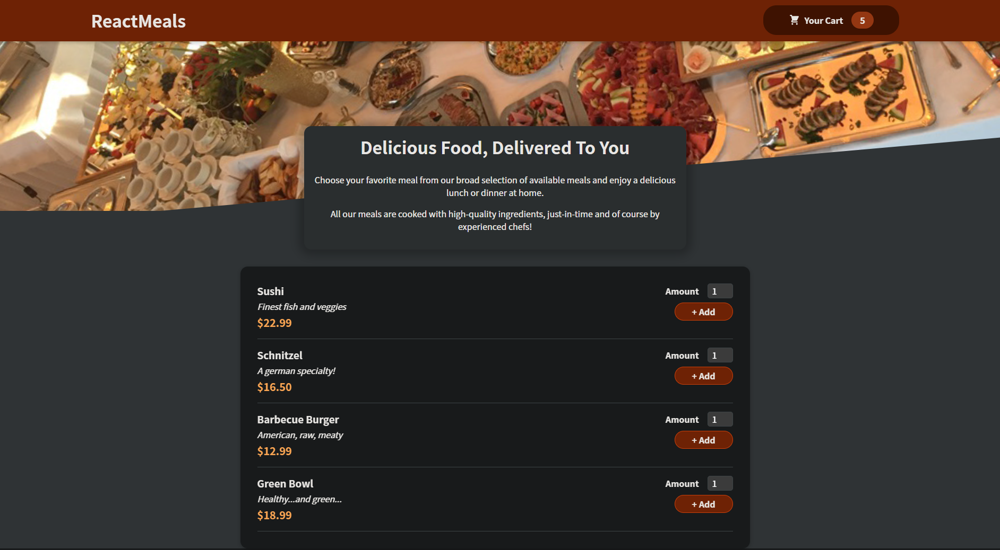

# Food Order App - [Demo](https://food-order-app-lyart.vercel.app/)

### A Simple Food Order App where you can add, remove, and order items with a cool transition made in CSS. There is a fetched data in this App via Google Firebase. I have created a real-time database in Firebase and stored food data in there to have the orders possible. When a user orders a new food, it will be directly stored in Google Firebase Database as a real-time database.

#### Please feel free to visit the Demo of the App and order a food from the menu.

### Tech Stacks

`React.js`, `Hooks`, `CSS`, `React forms`, and `Google Firebase`.
